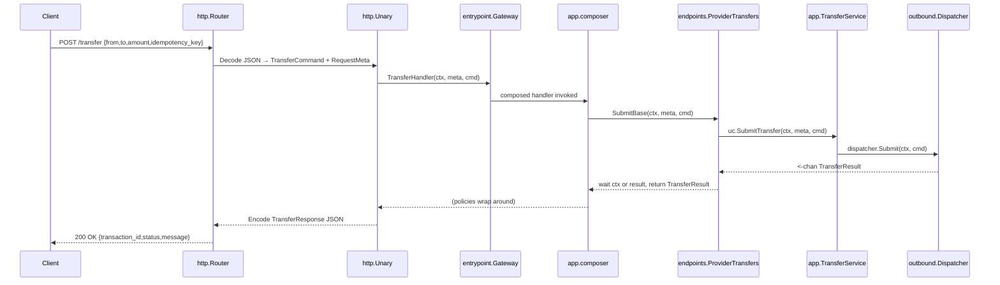
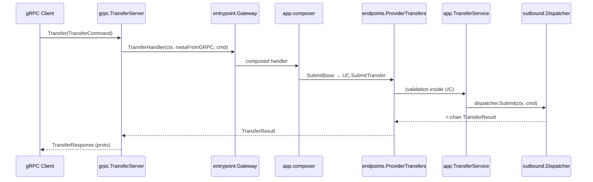

# Fintech Capstone – API Gateway Developer Guide

> An approachable, end‑to‑end guide to the API Gateway slice of the codebase. It explains the architecture, request flow, extensibility points, and operational tips. It’s written for engineers new to the project who want to get productive fast.

---

## TL;DR

- **Style:** Hexagonal (Ports & Adapters) around a single use case: _Transfers_.
- **Transports:** HTTP & gRPC share the same core **inbound ports** and **use case**.
- **Policies (middleware):** Idempotency → Rate limit → Timeout → Latency (in that order), wrapped by request counters.
- **Workers:** A pluggable `outbound.Dispatcher` executes transfer jobs and exposes queue/worker metrics.
- **Contracts:** Simple JSON & protobuf shapes. Consistent error mapping across transports.

---

## Directory Map (annotated)

```
internal/api_gateway/
  adapters/inbound/
    http/           # net/http transport: router + generic unary adapter
    grpc/           # gRPC transport: generated proto + thin server adapter
  app/
    composer/       # middleware policy composition
    endpoints/      # glue between use‑case and network handler
    middleware/     # reusable inbound middleware (metrics, chain helpers)
    policy/         # domain policy middlewares (idempotency, RL, timeout, latency)
    transfer_service.go  # primary use case
  contracts/        # external wire contracts (HTTP JSON, metrics snapshot)
  entrypoint/       # Gateway facade: exposes handlers and system endpoints
  ports/
    inbound/        # hex inbound ports & shared types (requests, results, meta)
    outbound/       # hex outbound ports (dispatcher, idempotency, limiter, metrics)
internal/platform/  # logging, http kit, app errors, adapters
```

---

## Architecture at a Glance

This module is a textbook hexagonal architecture:

- **Inbound Ports** (`ports/inbound`): transport‑agnostic request/response shapes and handler contracts (generic `UnaryHandler`, `UnaryMiddleware`, `RequestMeta`, `TransfersUseCase`, `TransferCommand`/`TransferResult`).
- **Outbound Ports** (`ports/outbound`): capabilities the core depends on: `Dispatcher`, `Limiter`, `Idempotency[T]`, and `Metrics`.
- **Adapters** (`adapters/inbound/http|grpc`): encode/decode & error mapping; convert wire formats → `TransferCommand` and back.
- **App layer** (`app/`):

  - **Use case:** `TransferService` validates and submits work to a `Dispatcher`.
  - **Policies:** idempotency/rate‑limit/timeout/latency as composable middlewares.
  - **Endpoints:** `ProviderTransfers.SubmitBase` bridges the async use case (channel) back to a unary handler.
  - **Composer:** assembles middlewares according to a policy order.

- **Entrypoint** (`entrypoint.Gateway`): keeps handlers/dataflow wiring cohesive; also serves `/healthz` and `/metrics`.
- **Platform** (`internal/platform`): logging, HTTP helpers, rate‑limit shim for HTTP ingress, standardized `apperr` error mapping.

---

## End‑to‑End Flow (HTTP)



### End‑to‑End Flow (gRPC)



---

## Policies & Middleware

### Default policy order

`Idempotency → RateLimit → Timeout → Latency`

**Why this order?**

- **Idempotency first:** cheap cache lookup short‑circuits duplicated retries early, reducing system load even if other limits would have rejected later.
- **Rate limit next:** protects shared resources after idempotent hits have been filtered out.
- **Timeout:** bounds work per request.
- **Latency observation:** measured around the final result regardless of outcome.

### Where they live

- `app/policy/*` expose middlewares parameterized by outbound ports.
- `app/middleware/*` contains generic middleware like request counting and chain utilities.
- `app/composer` assembles the stage‑ordered chain and returns a single `UnaryHandler`.

### Early HTTP ingress protection

`internal/platform/http_kit/limiter.LightLimiter` is used at the HTTP layer **before** the body is read to drop obvious bursts (429). It’s separate from the domain `outbound.Limiter` used in policy.

---

## Contracts (wire formats)

### HTTP

- **POST** `/transfer`

  - Request JSON:

    ```json
    { "from": "A123", "to": "B999", "amount": 1500, "idempotency_key": "k-123" }
    ```

  - Response JSON (`contracts.TransferResponse`):

    ```json
    {
      "transaction_id": "c6c4...-uuid",
      "status": "success",
      "message": "optional"
    }
    ```

- **GET** `/metrics` → `contracts.MetricsSnapshot`

  ```json
  {
    "requests_total": 12345,
    "success_rate": 0.992,
    "avg_latency_ms": 12.3,
    "active_workers": 8,
    "queue_depth": 3
  }
  ```

- **GET** `/healthz` → `{ "status": "ok" }`

### gRPC (protobuf)

- Service: `transfer.v1.TransferService/Transfer`
- Messages: `TransferCommand { from_account, to_account, amount_cents, idempotency_key }` → `TransferResponse { transaction_id, status, message }`

---

## Error Mapping (consistent across transports)

### HTTP mapping (`adapters/inbound/http/unary.go`)

| apperr.Code           | HTTP Status               |
| --------------------- | ------------------------- |
| `CodeInvalid`         | 400 Bad Request           |
| `CodeRateLimited`     | 429 Too Many Requests     |
| `CodeTimeout`         | 504 Gateway Timeout       |
| `CodeNotFound`        | 404 Not Found             |
| `CodeConflict`        | 409 Conflict              |
| `CodePayloadTooLarge` | 413 Payload Too Large     |
| _(default)_           | 500 Internal Server Error |

### gRPC mapping (`adapters/inbound/grpc/error_map.go`)

| apperr.Code           | gRPC code           |
| --------------------- | ------------------- |
| `CodeInvalid`         | `InvalidArgument`   |
| `CodeRateLimited`     | `ResourceExhausted` |
| `CodeTimeout`         | `DeadlineExceeded`  |
| `CodeNotFound`        | `NotFound`          |
| `CodeConflict`        | `AlreadyExists`     |
| `CodePayloadTooLarge` | `ResourceExhausted` |
| _(default)_           | `Internal`          |

---

## Use Case: `TransferService`

- Validates `TransferCommand` (non‑empty accounts, positive amount, idempotency key present) → otherwise `apperr.Invalid`.
- Delegates to `outbound.Dispatcher.Submit(ctx, cmd)` and returns a **receive‑only** channel of `TransferResult`.
- The `endpoints.ProviderTransfers.SubmitBase` waits on either `ctx.Done()` (cancellation/timeout) or the channel to produce a unary response.

### Transfer result model

`inbound.TransferResult` is transport‑agnostic and carries `{ transactionID uuid.UUID, status ResultStatus, message string }`, where `ResultStatus ∈ { success, rejected, rate_limited, duplicate }`.

---

## Metrics

The `outbound.Metrics` facade groups three concerns:

- **Counters**: `IncRequest`, `IncSuccess`, `IncRateLimited`, `IncTimeout`, `IncIdempotentHit`.
- **Latency**: `ObserveLatency(duration)`.
- **Snapshot**: `Snapshot() contracts.MetricsSnapshot` (exported at `/metrics`, augmented by `dispatcher.ActiveWorkers()` and `dispatcher.QueueDepth()`).

**Where increments happen**

- `CountRequests` middleware adds a cheap request counter.
- Policy middlewares bump `IncRateLimited` / `IncTimeout` / `IncIdempotentHit`.
- Latency is observed at the tail.

---

## Extending the Gateway

### Add a new endpoint (HTTP + gRPC)

1. **Define input/output** in `ports/inbound` (command/result interfaces or structs).
2. **Add use case** in `app/` implementing the relevant inbound port(s).
3. **Create endpoint provider** in `app/endpoints` to bridge async → unary if needed.
4. **Compose policies** with `app/composer` (use `NewComposer` or `NewIdempotentComposer`).
5. **Wire to Gateway** via an `Option` (like `WithTransfer`) and expose a handler.
6. **HTTP adapter:** add a `Decoder`/`Encoder` in `adapters/inbound/http` and register the route in `router.go` using `Unary`.
7. **gRPC adapter:** update/create proto, re‑gen, and implement the thin server forwarding to the gateway handler.

### Add a policy (e.g., circuit breaker)

- Implement `inbound.UnaryMiddleware[Com, Res]`.
- Pick a **stage** or add a new one in `policy/stages.go`.
- Update `DefaultPolicyOrder` if needed.
- Have `composer.Build` inject it when configured.

### Swap/implement outbound capabilities

- **Dispatcher:** provide a worker pool with `Submit(ctx, cmd)` returning a result channel + `ActiveWorkers`/`QueueDepth`.
- **Limiter:** implement `outbound.Limiter.Allow(clientID string) bool` for domain RL.
- **Idempotency:** provide `Get/Store` for `TransferResult` keyed by idempotency key (consider TTL/eviction).
- **Metrics:** implement counters/latency/snapshot aggregation (e.g., Prometheus adapter + in‑memory snapshot).

---

## Operational Runbook

- **HTTP server** (`adapters/inbound/http/server.go`): configurable read/write/idle timeouts; graceful `Shutdown(ctx)`.
- **gRPC server**: `GracefulStop` on context cancellation; force `Stop` if deadline passes.
- **Ingress protection:** `RateLimitHTTP` uses `LightLimiter.Allow` and returns early `429` with `Retry-After: 1`.
- **Observability:**

  - `/metrics` for a compact snapshot (requests, success rate, avg latency, active workers, queue depth).
  - `/debug/pprof/*` handlers are exposed.
  - `platform.Logger` has adapters for zap and stdlib.

---

## Quickstart (local dev)

- **HTTP**

  - Wire a simple dispatcher (in‑memory worker pool) that satisfies `outbound.Dispatcher`.
  - Build `http_transport.NewRouter(gateway, logger)` and serve via `http_transport.NewHTTPServer(...)`.
  - `curl` example:

    ```bash
    curl -X POST :8080/transfer \
      -H 'Content-Type: application/json' \
      -H 'X-Client-ID: demo' \
      -d '{"from":"A1","to":"B1","amount":500,"idempotency_key":"k1"}'
    ```

- **gRPC**

  - Register `grpc_transport.NewTransferServer(gateway)` with `grpc.NewServer()`.
  - Use the generated client (see `proto/transfer_grpc.pb.go`).

---

## Glossary

- **Hexagonal architecture:** A style where business logic depends on _ports_ (interfaces), and adapters implement those ports for IO concerns.
- **Unary handler:** A function that accepts `(ctx, meta, req)` and returns `(res, err)`—like a normal RPC call—with middlewares wrapping it.
- **Idempotency:** Multiple identical requests (same key) produce exactly the same result without re‑executing side effects.

---
